## What OpenLayers can do for you? Usages and ecosystem

par [@ThomasG77](https://twitter.com/ThomasG77),
[WebGeoDataVore](http://webgeodatavore.com)

---

# Who I Am?

Freelance GIS Expert, doing also OpenData and data visualisation, based in France 
My activities are consultancy, training and on-demand development.

I wrote a book on [OpenLayers 3](https://www.packtpub.com/web-development/openlayers-3-beginner%E2%80%99s-guide)

I mainly develop with JavaScript and Python.

---

# OpenLayers in short

OpenLayers 3 is a JavaScript library for online mapping, release under [BSD
2-Clause](https://tldrlegal.com/license/bsd-2-clause-license-(freebsd) license.

Its philosophy could be describe as follow:

> *Maintain a core with extended functionalities with the choice to remove unused library parts depending of your application code.*  

This is possible using Google Closure Compiler.

---

# OpenLayers 3 choice: the 80/20 rule

----

There are many other choices to do web mapping, in particular the strong contender [Leaflet](http://leafletjs.com)

### You are in the 80% requirements.

In our opinion, as long as your don't meet advanced requirement like projections, canvas rotation or need to consume OGC web services (for SDI for example), you can choose the approach light library "à la Leaflet" with plugins.

----

### If you need more than the 80% to achieve your requirements.

If you need a lot of advanced functions without the third party plugins code quality variations, choose OpenLayers 3 as the features coverage is larger than Leaflet with it philosophy of a well maintained small core.

If you are not sure about the requirements you will have, you may prefer OpenLayers to limit the risk to switch later.

No opposition between both OpenLayers and Leaflet libraries: this vision is shared by companies or web mapping agencies that nowadays support both OpenLayers 3 and Leaflet clients.

---

# Usages - the three pillars

## Displaying

## Interacting

## Processing

---

# Displaying

----

## Different data sources - WMS

<a href="http://mapshup.com/projects/rocket/#/search?collection=Pleiades&page=1&_view=map&q=southampton,%20uk&_center=-144375,6591523.4375,10">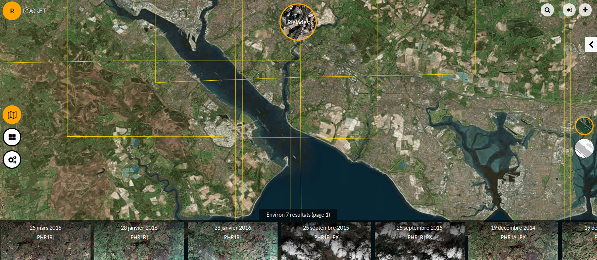</a>

----

## Different data sources - OpenStreetMap tile based sources

<a href="http://openlayers.org/en/master/examples/stamen.html">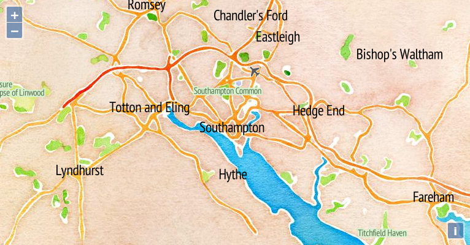</a>

----

## Different data sources - GeoJSON

----

## Different data sources - Mapbox Vector Tiles

<a href="http://stvno.github.io/page/cbsexplorerol/index.html">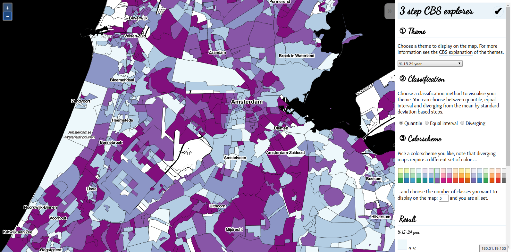</a>

----

## Client-side reprojection

----

## Maps or not?

### High-resolution images viewer

<a href="http://klokantech.github.io/iiifviewer/">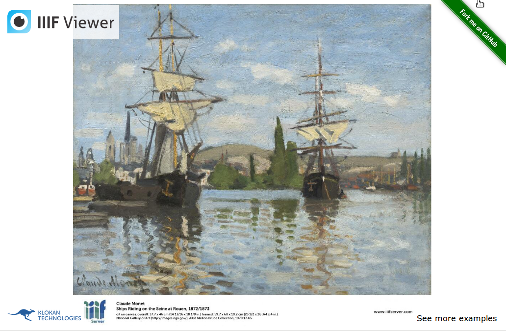</a>

See also the [Zoomify demo](http://openlayers.org/en/master/examples/zoomify.html)

----

## Overlay or side by side?

### National Library of Scotland

<a href="http://maps.nls.uk/geo/explore/sidebysideswipe.cfm#zoom=10&lat=50.9143&lon=-1.5875&layers=1&right=BingHyb">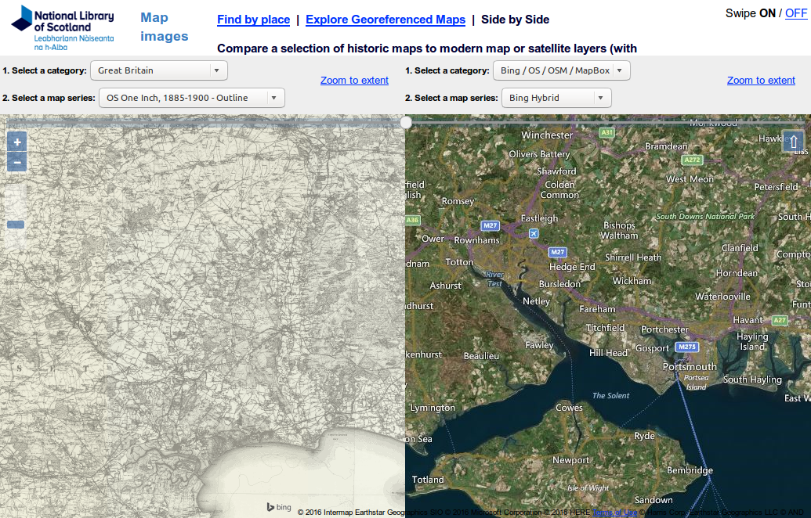</a>

----

## Styling - client-side

<a href="http://openlayers.org/en/master/examples/mapbox-vector-tiles-advanced.html">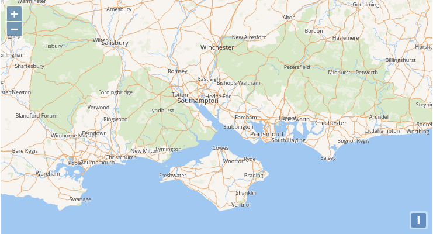</a>

----

## Styling - multiple styles for a layer

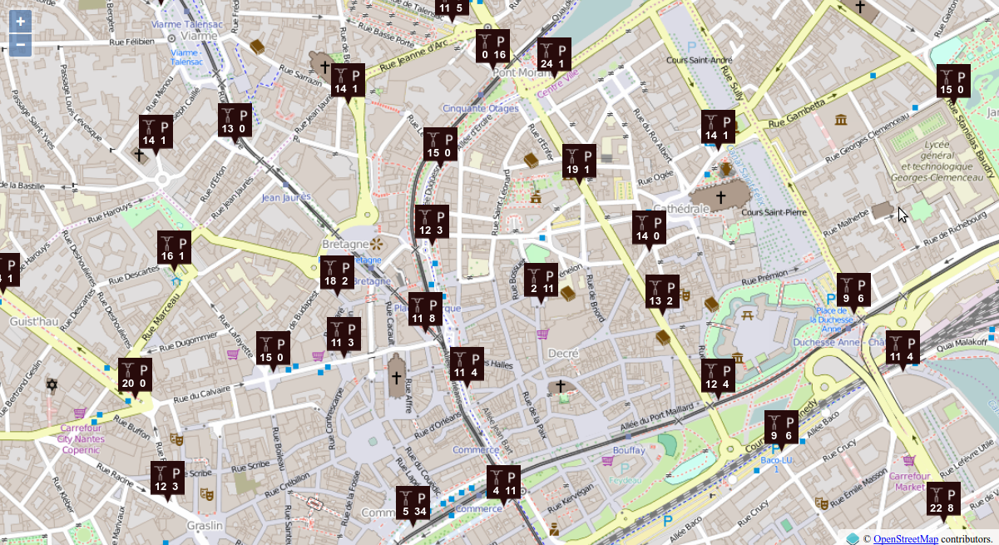

----

## Alternative representations - advanced clustering

<a href="http://viglino.github.io/OL3-AnimatedCluster/">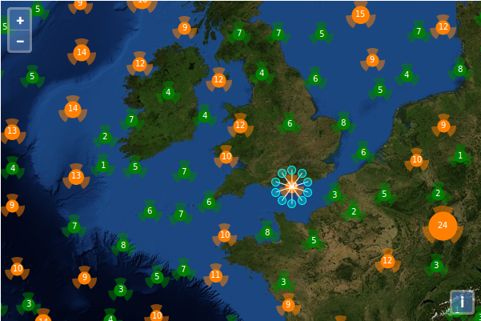</a>

----

## Multiple views & renderers

<a href="http://openlayers.org/en/master/examples/side-by-side.html">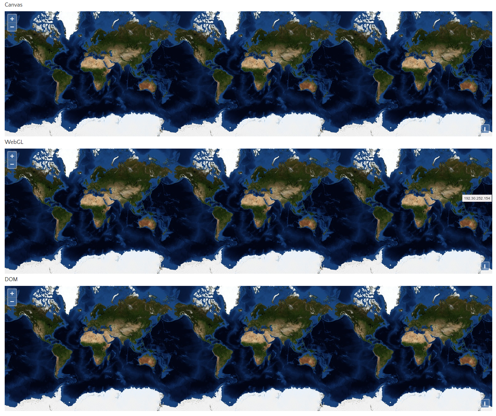</a>

Default Canvas renderer. Drawback: the most interesting renderer, WebGL, does not support all vector types. Funding wanted!

----

## 2D/3D combined with Cesium

[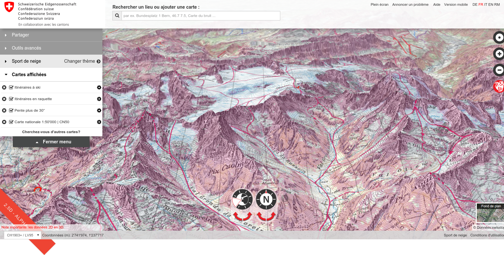](https://map.geo.admin.ch)

See the [OpenLayers-Cesium project](http://openlayers.org/ol3-cesium/)

---

# Interacting

----

## Interacting

Although interactions can concern zooming, panning, keyboard manipulation and mouse/touch related behaviour, we will focus on querying informations from layers and drawing here.

----

## Querying: the options

* Client-side vector

* Server-side vector with WFS

* WMS with GetFeatureInfo

* UTF-Grid

----

## Client-side vector

<a href="http://wilson.boundlessps.com:8080/BoulderCountyFloods2013/">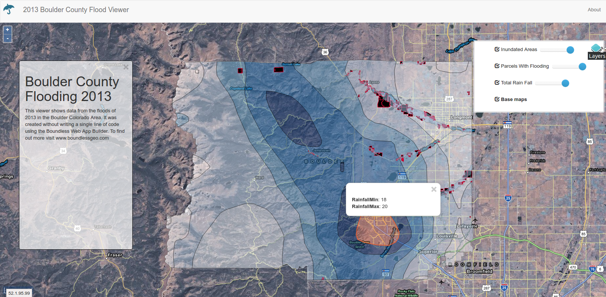</a>

It uses `forEachFeatureAtPixel` (from `ol.Map`). See [associated demo](http://openlayers.org/en/master/examples/kml-timezones.html)

----

## Server-side vector with WFS

<a href="http://openlayers.org/en/master/examples/vector-wfs-getfeature.html">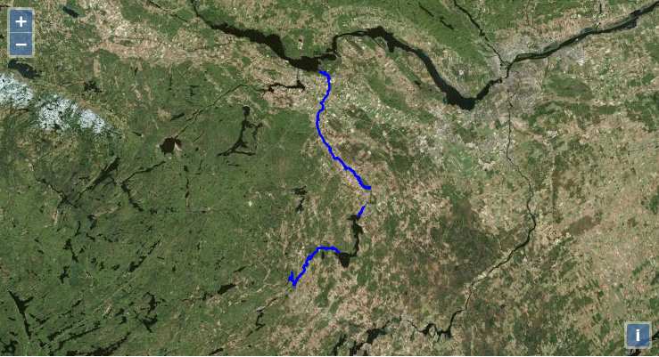</a>

You pass filter encoding string in the GET or POST URL

----

## WMS with GetFeatureInfo

Use `forEachLayerAtPixel` (from `ol.Map`) combined with `getGetFeatureInfoUrl` (from `ol.source.ImageWMS` or `ol.source.TileWMS`) See [associated demo](http://openlayers.org/en/master/examples/getfeatureinfo-image.html)

----

## UTFGrid - population census

Look at class `ol.source.TileUTFGrid` and [associated demo](http://openlayers.org/en/master/examples/tileutfgrid.html)

----

## Display element on the top of your map

<a href="demos/overlay-simple.html">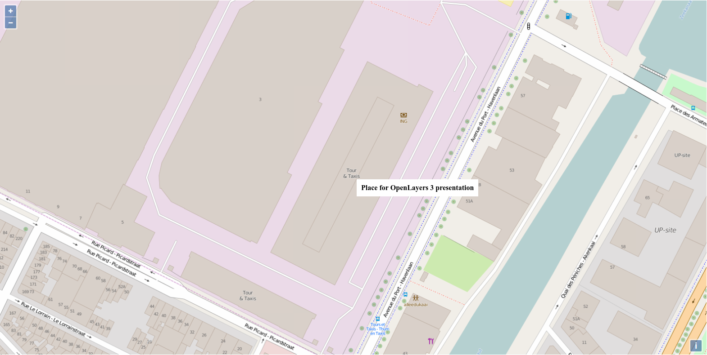</a>

You will need an Overlay (`ol.Overlay`). It position changes depending of geographical coordinates.

----

## Selecting

### To draw and select

<a href="https://rawgit.com/webgeodatavore/ol3-extras-demos/master/select-jsts/select-advanced.html">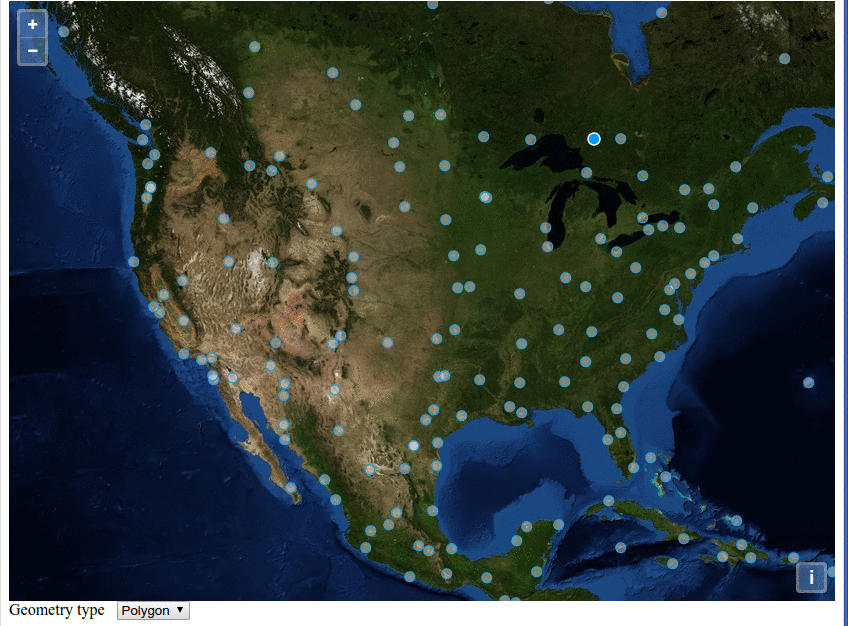</a>

----

## Drawing/modifying

<a href="https://cdn.rawgit.com/HamHamFonFon/ol3-drawButtons/master/examples/basic_use.html">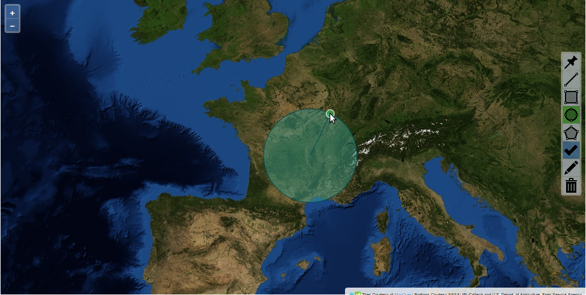</a>

---

# Processing

----

## Raster processing

### Pseudo-3D view for shaded relief

[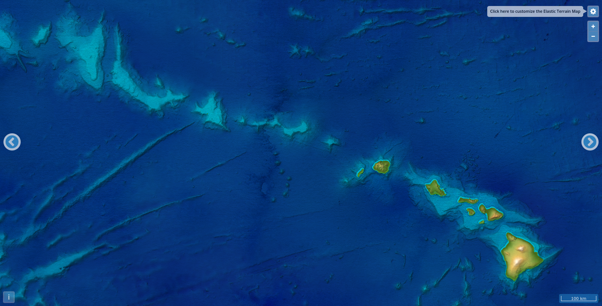](http://elasticterrain.xyz)

----

## Raster processing

### Satellite-image diff in the browser

<a href="https://www.youtube.com/watch?v=XxFiaVpaYP0">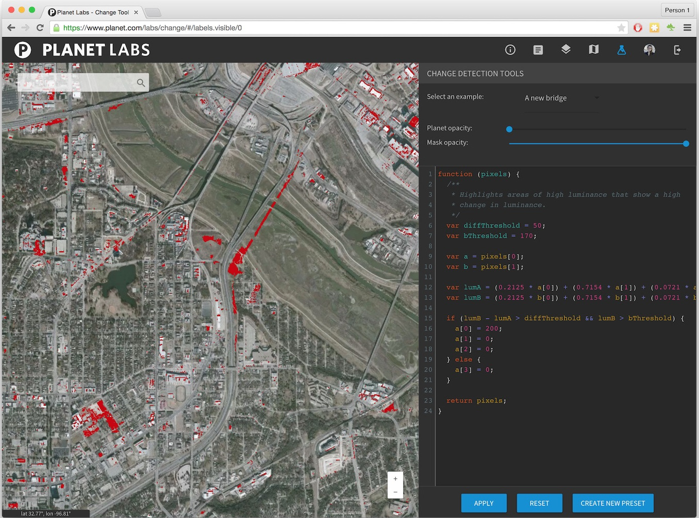</a>

----

## Vector processing with JSTS

<a href="http://bl.ocks.org/ThomasG77/31037a8897b4980a0818">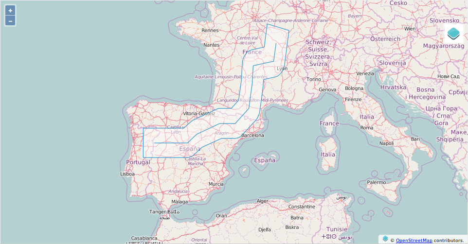</a>

----

## Vector processing with Turf

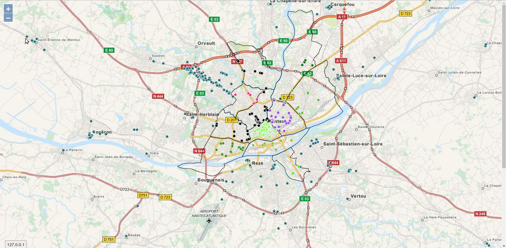

---

# Ecosystem

----

## A growing ecosystem

There are various ways to create plugins at the moment.

We maintain a repository covering the ecosystem called [awesome-openlayers](https://github.com/webgeodatavore/awesome-openlayers/)

*Protips:*

You may ask why "awesome-...", look at [awesome-vector-tiles](https://github.com/mapbox/awesome-vector-tiles) or [awesome-javascript](https://github.com/sorrycc/awesome-javascript). When you search a programming topic, search in a search engine "awesome-yourprogrammingtopic"

Covering all from this list would not be possible. So, what can you take from the list?

----

## With frameworks or frameworkless?

You mainly have choices between:

* Angular based solutions
* React based solutions
* GeoExt based solutions
* Vanilla JavaScript or jQuery based solutions (we consider them as frameworkless)

More or less intrusive frameworks. Choices depend of skills and team/developers personalities.

----

## The "no-code approach" with Desktop GIS to OpenLayers 3

* [qgis2web](https://github.com/tomchadwin/qgis2web) Export from QGIS to various web mapping library including OpenLayers (a Desktop GIS software)
* [Web App Builder](http://boundlessgeo.com/2015/06/building-openlayers-3-web-app-without-writing-code/)

----

## One example for inspiration

One of the most impressive is [OL3-ext](http://viglino.github.io/ol3-ext/) for its variety.

---

# References

----

## Official

* [Official website](http://openlayers.org)
* [Examples](http://openlayers.org/en/master/examples/)
* [API documentation](http://openlayers.org/en/master/apidoc/)
* [Workshop](http://openlayers.org/workshop/)
* [Custom builds](https://github.com/openlayers/builder)

----

## Books

* [OpenLayers 3 Beginner’s Guide](https://www.packtpub.com/web-development/openlayers-3-beginner%E2%80%99s-guide) by Thomas Gratier, Paul Spencer & Erik Hazzard and [code samples](http://openlayersbook.github.io)) (January 2015)
* [The book of OpenLayers 3 - Theory and Practice](https://leanpub.com/thebookofopenlayers3) with [code samples](http://www.acuriousanimal.com/thebookofopenlayers3/) by Antonio Santiago Perez
* [Mastering OpenLayers 3](https://www.packtpub.com/web-development/mastering-openlayers-3) by Gábor Farkas (January 2016)
* [OpenLayers 3.x Cookbook - Second Edition](https://www.packtpub.com/web-development/openlayers-3x-cookbook-second-edition) by Peter J. Langley, Antonio Santiago Perez (March 2016)

---

# Questions
